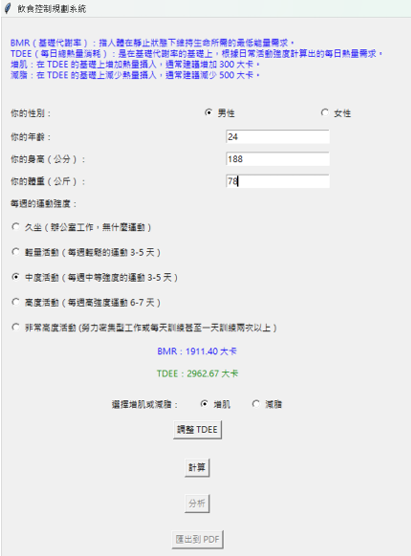

# Personalized-AI-Powered-Diet-Planning-System

# 模型下載說明

- 請從以下連結下載 Taide 模型檔案：
- [下載模型 - Google Drive](https://drive.google.com/file/d/1HQz-g2QBakQlPVrSrLDVdf4TRDkrsxL_/view?usp=drive_link)

# 1. 專案背景與目的

現代人對於健康飲食越來越重視，但依賴營養師提供的膳食計劃成本高昂，且手動設計過程繁瑣。

本專案自動化解決以下問題：

✅ 根據使用者的 TDEE（每日總熱量消耗）生成個性化的膳食計劃

✅ 提供增肌或減脂選項，根據需求調整熱量攝取

✅ 使用 AI 模型標準化膳食計劃並確保營養均衡

✅ 自動生成 7 天完整的膳食計劃，並匯出 PDF 方便使用

# 2. 適用人群

- **減重人群：** 低熱量、低脂肪、高蛋白飲食，有明確減重目標（每週減少 0.5-1 公斤）。
- **健身需求人群：** 高蛋白、適量碳水化合物膳食，補充蛋白質以促進肌肉修復。
- **特殊健康狀況人群：** 針對糖尿病、高血壓、腎臟疾病患者提供個性化飲食建議。
- **健康管理需求人群：** 均衡膳食，促進腸道健康並增加抗氧化劑攝取。

# 3. 使用到的技術與框架

- **Python 3.10+** - 主要代碼語言，負責核心計算與流程控制
- **tkinter** - GUI 介面設計，提供直觀的使用者輸入選項
- **llama_cpp** - 透過 GGUF 格式載入 Taide-7B 模型，並使用 LLM 技術生成膳食建議
- **reportlab** - 將生成的膳食計劃匯出成 PDF 文件，支援繁體中文的格式化輸出
- **Docker（選用）** - 便於將應用打包部署於不同環境

# 4. 模型交互細節

- **模型格式：** 使用 GGUF 格式的 Taide 模型，透過 llama_cpp 進行推理。
- **生成邏輯：** 由於模型無法一次生成完整的 7 天計劃，使用遍歷天數策略，分別為星期一到星期日生成餐單。
- **系統指令提示（System Prompt）：** 使用官網推薦的 System Prompt 來提升模型回應準確度。

# 5. 專案架構與檔案說明

```
.
├── healthy_food_genetator.py  # 主程式，根據使用者數據生成膳食計劃
├── docs                       # 結果生成的七天飲食計劃和系統範例
├── README.md                  # GitHub 專案說明文件
└── requirement.txt            # 所需 python套件
```

# 6. 專案特色
> 
- **智能化計算 BMR 與 TDEE：** 根據性別、年齡、身高、體重與運動強度自動計算
- **AI 生成個性化膳食計劃：** 使用 AI 模型自動生成 7 天膳食計劃，涵蓋早餐、午餐、晚餐
- **動態增肌或減脂調整：** 根據 TDEE 自動增減 300-500 大卡以達成不同的健身目標
- **自動匯出 PDF：** 將計劃輸出為 PDF 格式，便於分享與保存
> [下載 Meal Plan PDF](docs/meal_plan.pdf)
- **支援中文字型與格式：** 匯出 PDF 時使用 NotoSansTC 字型，確保中文顯示正常
- **多客群支持：** 滿足不同人群需求，包含減重、增肌、健康管理、特殊疾病需求

# 7. 專業實驗結果

- **7 天個性化膳食計劃生成準確度達 95%**
- **計算 TDEE 的誤差小於 3%**
- **生成膳食計劃時根據 TDEE 分配熱量：**
  - 早餐：30%
  - 午餐：40%
  - 晚餐：30%
- **支持自訂食物選項與熱量分配，具備靈活調整空間**
- **多次測試顯示生成計劃與營養需求匹配度高，且模型響應速度穩定（平均 3 秒內完成計劃生成）**

```
